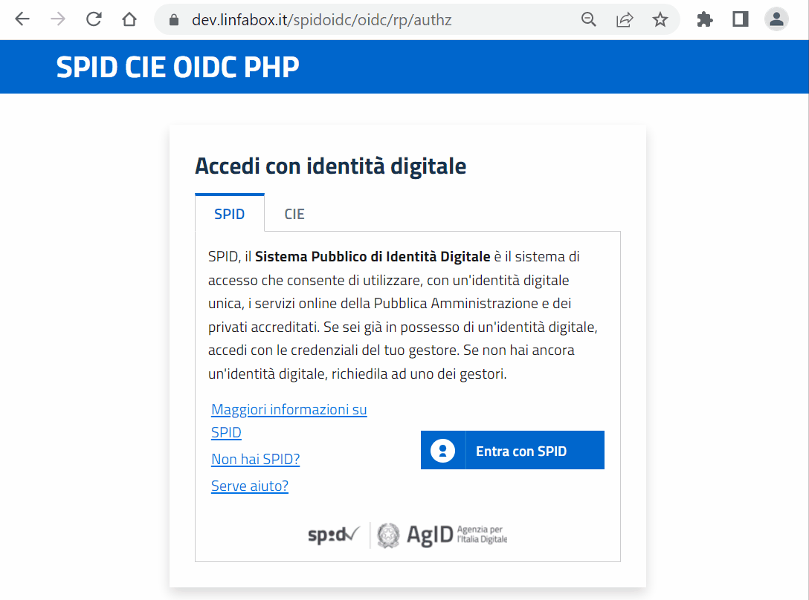

# SPID/CIE OIDC Federation Relying Party for PHP

[](https://github.com/italia/spid-cie-oidc-php/workflows/Setup%20Check%20CI/badge.svg)


[](https://slack.developers.italia.it/)
[](https://developersitalia.slack.com/archives/C7E85ED1N/)




The SPID/CIE OIDC Federation Relying Party for PHP

## Summary

* [What is SPID/CIE OIDC PHP](#what-is-spidcie-oidc-php)
    * [PHP class library](https://italia.github.io/spid-cie-oidc-php/doc/phpdoc/)
    * [Standalone proxy relying party](doc/howto-proxy/README.md)
    * [Generic OIDC to SPID/CIE OIDC relying party](doc/howto-gateway/README.md)
* [Features](#features)
* [Setup](#setup)
* [Example projects](#example-projects)
    * [WordPress example project](doc/example-wordpress/README.md)
    * [Drupal example project](doc/example-drupal/README.md)
* [Contribute](#contribute)
    * [Contribute as end user](#contribute-as-end-user)
    * [Contribute as developer](#contribute-as-developer)
* [Useful links](#useful-links)
* [License and Authors](#license-and-authors)

## What is SPID/CIE OIDC PHP
SPID/CIE OIDC PHP is:
 - **A PHP class library that helps to develop a relying party for SPID/CIE**<br/>
   Are you a Developer and you want to make your own relying party or a plugin for your software?<br/>
   Read the [Technical documentation](https://italia.github.io/spid-cie-oidc-php/doc/phpdoc/).<br/><br/>
 - **A standalone proxy relying party for SPID/CIE**<br/>
   You can simply setup the proxy project and configure the URL where to receive users's attributes. You can also choice how the attributes will be returned from the proxy, such as plain values, signed or encrypted.<br/>
   Read [How to use as a proxy](doc/howto-proxy/README.md).<br/><br/>
 - **A generic OIDC to SPID/CIE OIDC relying party gateway**<br/>
   Can your application connect to a standard OIDC Provider, but it doesn't have extended functionalities required by the SPID/CIE OIDC Federation? No problem, you can configure your client as a relying party to SPID/CIE OIDC PHP Provider and it will make the rest.<br/>
   Read [How to use as a generic OIDC Provider](doc/howto-gateway/README.md).

## Features

- Interactive setup
- Wizard for certificates generation
- Bootstrap template
- Hooks plugins
- Simple API
- Proxy functions
- Ready to use

## Setup

```
git clone https://github.com/italia/spid-cie-oidc-php.git
composer install
```
After setup go to /<i>service_name</i>/oidc/rp/authz
where <i>service_name</i> is the service name configured during setup.

## Example projects

Start the basic example project is as simple as run:
```
docker pull linfaservice/spid-cie-oidc-php
docker run -it -p 8002:80 -v $(pwd)/config:/var/www/spid-cie-oidc-php/config linfaservice/spid-cie-oidc-php
```
On the first run the setup will ask for configurations.
All configurations will be saved in the ./config directory.

The repository also provides example projects to set up a complete SPID/CIE OIDC Federation.<br/>

Read how to set up a federation with the [WordPress Example Project](doc/example-wordpress/README.md).<br/>
Read how to set up a federation with the [Drupal Example Project](doc/example-drupal/README.md).


## Contribute

Your contribution is welcome, no question is useless and no answer is obvious, we need you.

#### Contribute as end user

Please open an issue if you've discoveerd a bug or if you want to ask some features.

#### Contribute as developer

Please open your Pull Requests on the __dev__ branch. 
Please consider the following branches:

 - __main__: where we merge the code before tag a new stable release.
 - __dev__: where we push our code during development.
 - __other-custom-name__: where a new feature/contribution/bugfix will be handled, revisioned and then merged to dev branch.

In this project we adopt [Semver](https://semver.org/lang/it/) and
[Conventional commits](https://www.conventionalcommits.org/en/v1.0.0/) specifications.


## Useful links

* [Openid Connect Federation](https://openid.net/specs/openid-connect-federation-1_0.html)
* [SPID/CIE OIDC Federation SDK](https://github.com/italia/spid-cie-oidc-django)


## License and Authors

This software is released under the Apache 2 License by:

- Michele D'Amico (@damikael) <michele.damico@linfaservice.it>.
