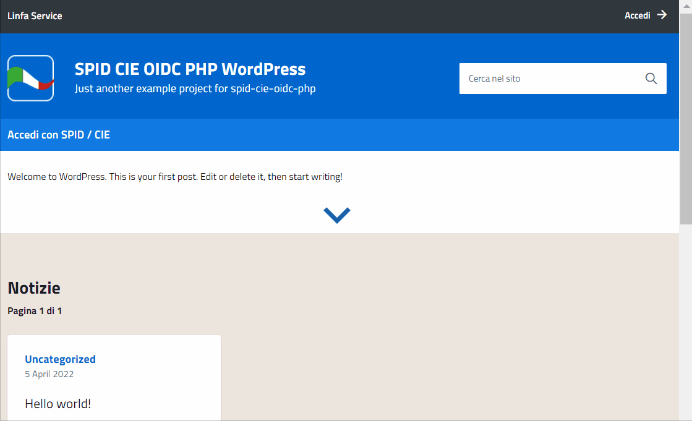

# WordPress example project

The WordPress example project use SPID/CIE OIDC PHP as [Generic OIDC to SPID/CIE OIDC relying party](/doc/howto-gateway/README.md).

In this demo has been used:
 - [ItaliaWP2 WordPress theme](https://github.com/italia/design-wordpress-theme-italiaWP2)
 - [OpenID Connect generic client plugin](https://wordpress.org/plugins/daggerhart-openid-connect-generic/)

 

## How to run with Docker
To set up a complete SPID/CIE OIDC Federation clone the [Django repository](https://github.com/italia/spid-cie-oidc-django) and add the following section into the docker-compose.yml file contained in the Django repo's root folder.

```
  relying-party-wordpress.org:
    image: linfaservice/spid-cie-oidc-php-wordpress
    expose:
      - 8004
    ports:
      - "8004:8004"
    networks:
      - oidcfed
```

Add the following mappings into your hosts file:

```
127.0.0.1 trust-anchor.org
127.0.0.1 cie-provider.org
127.0.0.1 relying-party.org
127.0.0.1 relying-party-php.org
127.0.0.1 relying-party-wordpress.org
```

Now you should be able to run the entire federation by just opening a Terminal session into the Django repo's root folder and running:

```
docker-compose up
```

The proxy relying party should respond to http://relying-party-php.org:8003/,<br/>the wordpress site configured to connect to the proxy should respond to http://relying-party-wordpress.org:8004/<br/>and the Trust Anchor should respond to http://trust-anchor.org:8000/.

Now navigate to the endpoint that shows the openid federation configuration of the proxy relying party as a decoded json (http://relying-party-php.org:8003/.well-known/openid-federation?output=json), you will receive something like the following output.

```
{
    "iss": "http://relying-party-php.org:8003/",
    "sub": "http://relying-party-php.org:8003/",
    "iat": 1649414421,
    "exp": 1680950421,
    "jwks": {
        "keys": [...]
    },
    "authority_hints": [
        "http://trust-anchor.org:8000/"
    ],
    "trust_marks": [],
    "metadata": {
        "openid_relying_party": {
            "application_type": "web",
            "client_registration_types": [
                "automatic"
            ],
            "client_name": "Relying Party PHP",
            "contacts": [
                "info@relying-party-php.org"
            ],
            "grant_types": [
                "authorization_code"
            ],
            "jwks": {
                "keys": [...]
            },
            "redirect_uris": [
                "http://relying-party-php.org:8003//oidc/redirect"
            ],
            "response_types": [
                "code"
            ],
            "subject_type": "pairwise"
        }
    }
}
```

Please, take note of the keys field value in the json, you will need it later in the onboarding phase.

Now you should be able to navigate the TA admin panel at the following url: http://trust-anchor.org:8000/admin.
Please enter the admin credentials, and you will be presented with the TA admin panel main page.

The onboarding process can be summarized as follows:

- Click on the "Onboarding registrations" link on the left to start the RP onboarding phase, the Onboarding page will show.
- Click on the "Add onboarding registration" button on the top-right corner, and a form will show.
- Fill the form with the requested data (now you can paste the keys value in the Public Jwks field) and click Save. The newly added RP should appear in the onboarded entities list.
- Now click on the "Federation entity descendants" button, in order to add the onboarded RelyingParty as a direct descendand of the TrustAnchor.
- Click on the "Add federation entity descendand" button on the top-right corner, and a form will show.
- Fill the form with the requested data (you should paste the same keys value in the Public Jwks field) and click Save. The newly added descendand should appear in the descendants list.
- Now click on the "Federation entity descendants assigned profiles" button, in order to assign a profile to the newly created descendant and have the trust mark generated for it.
- Click on the "Add federation entity descendand assigned profile" button on the top-right corner, and a form will show.
- Select the RP as the descendant, a profile (e.g. the Public one) and the Issuer (the Trust Anchor at http://trust-anchor.org:8000/) and click Save.
- The RP descendant should now appear in the associated policies.
- If you click again on the RP in the "Federation entity descendants assigned profiles" page, now you should see the generated Trust Mark.

Now you can perform a sample login/logout flow, since the OP will successfully resolve the Proxy RP's trust chain, by navigating the RP's home page (http://relying-party-php.org:8003/) or logging in from WordPress site (http://relying-party-wordpress.org:8004/).

